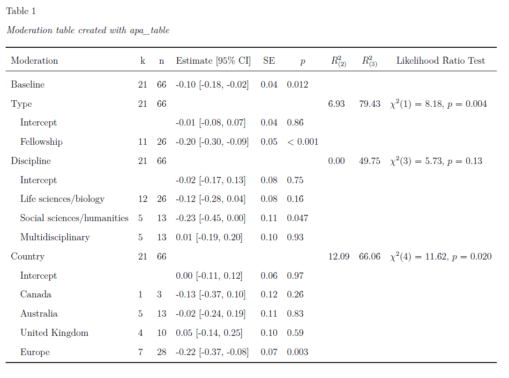
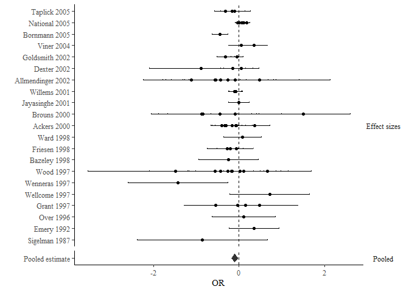
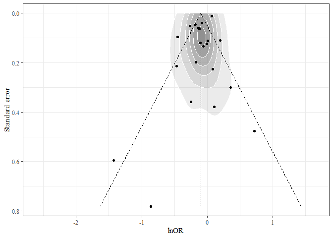

metaKIN
================

The purpose of ‘metaKIN’ is to assist users in efficiently specifying
metaSEM models.

## Installation

To install metaKIN run the following code:

``` r
#install.packages("remotes")
remotes::install_github("conig/metaKIN")
```

## Running analyses

This packages is a wrapper around the metaSEM package. It does not
perform any calculations itself, but rather converts your instructions
into metaSEM syntax. Resultant models are returned along with formatted
output. The full model call is reproducible so users can scrutinise
intermediate steps.

Functions are built around meta3 and tssem1 and tssem2

## Running a basic model with metaSEM

metaKIN will automatically load metaSEM (upon which it heavily depends).

To run a metaSEM model, you need an effect size, corresponding sampling
variance, and information about how effect sizes are clustered.

We’ll use the Bornmann07 dataset included in metaSEM. This meta-analysis
sought to determine whether women were more or less likely than men to
have their grant proposals approved.

``` r
library(metaKIN)
```

    ## metaKIN 0.1.3

    ## metaKIN is under active development.
    ## Report bugs to: https://github.com/conig/metaKIN/issues

``` r
dat <- metaSEM::Bornmann07

m0 <- meta3(
  y = logOR,
  v = v,
  cluster = Cluster,
  data = dat
)

summary(m0)
```

    ## 
    ## Call:
    ## meta3(y = logOR, v = v, cluster = Cluster, data = dat)
    ## 
    ## 95% confidence intervals: z statistic approximation (robust=FALSE)
    ## Coefficients:
    ##             Estimate  Std.Error     lbound     ubound z value Pr(>|z|)  
    ## Intercept -0.1007784  0.0401327 -0.1794371 -0.0221198 -2.5111  0.01203 *
    ## Tau2_2     0.0037965  0.0027210 -0.0015367  0.0091297  1.3952  0.16295  
    ## Tau2_3     0.0141352  0.0091445 -0.0037877  0.0320580  1.5458  0.12216  
    ## ---
    ## Signif. codes:  0 '***' 0.001 '**' 0.01 '*' 0.05 '.' 0.1 ' ' 1
    ## 
    ## Q statistic on the homogeneity of effect sizes: 221.2809
    ## Degrees of freedom of the Q statistic: 65
    ## P value of the Q statistic: 0
    ## 
    ## Heterogeneity indices (based on the estimated Tau2):
    ##                               Estimate
    ## I2_2 (Typical v: Q statistic)   0.1568
    ## I2_3 (Typical v: Q statistic)   0.5839
    ## 
    ## Number of studies (or clusters): 21
    ## Number of observed statistics: 66
    ## Number of estimated parameters: 3
    ## Degrees of freedom: 63
    ## -2 log likelihood: 25.80256 
    ## OpenMx status1: 0 ("0" or "1": The optimization is considered fine.
    ## Other values may indicate problems.)

The baseline model shows us the pooled log-odds of women having their
proposals approved relative to men. The intercept shows that for
included studies, the pooled log-odds for relative approval was -0.1
\[95%CI -.18, -.02\]. That women were less likely to have their prosals
approved.

I2_2 shows the proportion of heterogeneity within cluster. I2_3 shows
the heterogeneity between studies.

There was more heterogeneity between clusters than within clusters

## Moderation with metaKIN

metaSEM allows users to test for the effect of moderators. To do this, a
categorical moderator (e.g. Proposal type) must be converted to a matrix
(often by encoding dummy variable).

In metaKIN this process can be done automatically. Just provide the
baseline model and a variable or equation you wish to moderate by.

``` r
moderation_object = m0 |> 
  moderate("Proposal type" = Type)
moderation_object
```

    ## Moderation results:
    ## 
    ## I2(2): 15.7%
    ## I2(3): 58.4%
    ## ---------------------------------------
    ##      moderation  k  n R2_2 R2_3 p.value
    ## ---------------------------------------
    ## 1 Proposal type 21 66 0.07 0.79  0.004*
    ## ---------------------------------------
    ## All models converged.

The p-value demonstrates that the baseline model is significantly
improved by including gender as a moderator.

To get the specific values we can call summary on this object.
Additionally, we can request a transformation to something which is
easier to interpret than log-odds.

``` r
summary(moderation_object,
        transf = exp,
        transf_name = "OR [95% CI]")
```

    ## Moderation results
    ## -----------------------------------------------------------------------------
    ## Moderation     k  n       OR [95% CI] Estimate   SE       p R2(2) R2(3) LRT_p
    ## -----------------------------------------------------------------------------
    ## Baseline      21 66 0.90 [0.84, 0.98]    -0.10 0.04   0.012                  
    ## Proposal type 21 66                                          6.93 79.43 0.004
    ##   Intercept         0.99 [0.92, 1.07]    -0.01 0.04    0.86                  
    ##   Fellowship  11 26 0.82 [0.74, 0.91]    -0.20 0.05 < 0.001                  
    ## -----------------------------------------------------------------------------

We can see that females were less likely to get fellowships than males,
but about as likely to get other kinds of grants.

## Multiple moderator models

If we want to add more moderators we just throw them into the moderation
function as argument separated by commas. These models are estimated
separately.

``` r
moderation_object2 <- m0 |> 
  moderate(Type, Discipline, Country)

moderation_object2
```

    ## Moderation results:
    ## 
    ## I2(2): 15.7%
    ## I2(3): 58.4%
    ## ------------------------------------
    ##   moderation  k  n R2_2 R2_3 p.value
    ## ------------------------------------
    ## 1       Type 21 66 0.07 0.79  0.004*
    ## 2 Discipline 21 66 0.00 0.50   0.13 
    ## 3    Country 21 66 0.12 0.66  0.020*
    ## ------------------------------------
    ## All models converged.

We can see that including the moderator matrix for type and country
improved the baseline model’s fit, but discipline did not.

We can then format this table with another function

``` r
summary(moderation_object2,
        transf = exp,
        transf_name = "OR [95% CI]")
```

    ## Moderation results
    ## --------------------------------------------------------------------------------------------
    ## Moderation                    k  n       OR [95% CI] Estimate   SE       p R2(2) R2(3) LRT_p
    ## --------------------------------------------------------------------------------------------
    ## Baseline                     21 66 0.90 [0.84, 0.98]    -0.10 0.04   0.012                  
    ## Type                         21 66                                          6.93 79.43 0.004
    ##   Intercept                        0.99 [0.92, 1.07]    -0.01 0.04    0.86                  
    ##   Fellowship                 11 26 0.82 [0.74, 0.91]    -0.20 0.05 < 0.001                  
    ## Discipline                   21 66                                          0.00 49.75  0.13
    ##   Intercept                        0.98 [0.84, 1.13]    -0.02 0.08    0.75                  
    ##   Life sciences/biology      12 26 0.89 [0.76, 1.05]    -0.12 0.08    0.16                  
    ##   Social sciences/humanities  5 13 0.80 [0.64, 1.00]    -0.23 0.11   0.047                  
    ##   Multidisciplinary           5 13 1.01 [0.83, 1.23]     0.01 0.10    0.93                  
    ## Country                      21 66                                         12.09 66.06 0.020
    ##   Intercept                        1.00 [0.89, 1.13]     0.00 0.06    0.97                  
    ##   Canada                      1  3 0.87 [0.69, 1.10]    -0.13 0.12    0.26                  
    ##   Australia                   5 13 0.98 [0.79, 1.21]    -0.02 0.11    0.83                  
    ##   United Kingdom              4 10 1.06 [0.87, 1.28]     0.05 0.10    0.59                  
    ##   Europe                      7 28 0.80 [0.69, 0.93]    -0.22 0.07   0.003                  
    ## --------------------------------------------------------------------------------------------

By default, the intercept is calculated for all matrices which
represents the first level (for models including factors). The other
levels show the distance from the reference level. We can check what the
reference level for country is by looking at the first factor level:

``` r
levels(dat$Country)[1]
```

    ## [1] "United States"

If we do not want intercepts we can specify that in the formula, like in
regular regression equations:

``` r
moderation_object2.noint <- m0 |>
  moderate(Type = ~ Type - 1,
           Discipline = ~ Discipline - 1,
           Country = ~ Country - 1)
moderation_object2.noint
```

    ## Moderation results:
    ## 
    ## I2(2): 15.7%
    ## I2(3): 58.4%
    ## ------------------------------------
    ##   moderation  k  n R2_2 R2_3 p.value
    ## ------------------------------------
    ## 1       Type 21 66 0.07 0.79  0.004*
    ## 2 Discipline 21 66 0.00 0.50   0.13 
    ## 3    Country 21 66 0.12 0.66  0.020*
    ## ------------------------------------
    ## All models converged.

This doesn’t change model fit. But it does change how the model is
displayed. Now you can see all the levels; but there is no longer a
reference level, so each estimate is absolute (e.g. the coefficient for
Australia no longer describes the difference between Australia and USA.)

``` r
summary(moderation_object2.noint,
        transf = exp,
        transf_name = "OR [95% CI]")
```

    ## Moderation results
    ## --------------------------------------------------------------------------------------------
    ## Moderation                    k  n       OR [95% CI] Estimate   SE       p R2(2) R2(3) LRT_p
    ## --------------------------------------------------------------------------------------------
    ## Baseline                     21 66 0.90 [0.84, 0.98]    -0.10 0.04   0.012                  
    ## Type                         21 66                                          6.93 79.43 0.004
    ##   Grant                      13 40 0.99 [0.92, 1.07]    -0.01 0.04    0.86                  
    ##   Fellowship                 11 26 0.82 [0.76, 0.88]    -0.20 0.04 < 0.001                  
    ## Discipline                   21 66                                          0.00 49.75  0.13
    ##   Physical sciences           5 14 0.98 [0.84, 1.13]    -0.02 0.08    0.75                  
    ##   Life sciences/biology      12 26 0.87 [0.80, 0.95]    -0.14 0.04   0.001                  
    ##   Social sciences/humanities  5 13 0.78 [0.64, 0.95]    -0.25 0.10   0.013                  
    ##   Multidisciplinary           5 13 0.99 [0.87, 1.12]    -0.01 0.06    0.82                  
    ## Country                      21 66                                         12.09 66.06 0.020
    ##   United States               4 12 1.00 [0.89, 1.13]     0.00 0.06    0.97                  
    ##   Canada                      1  3 0.88 [0.72, 1.07]    -0.13 0.10    0.20                  
    ##   Australia                   5 13 0.98 [0.82, 1.17]    -0.02 0.09    0.82                  
    ##   United Kingdom              4 10 1.06 [0.91, 1.24]     0.06 0.08    0.48                  
    ##   Europe                      7 28 0.80 [0.73, 0.89]    -0.22 0.05 < 0.001                  
    ## --------------------------------------------------------------------------------------------

## Describing moderated tables

A method is provided to convert moderated tables to paragraph
descriptions which can be rendered in rmarkdown.

``` r
report(moderation_object2, rmarkdown = FALSE)
```

\[1\] “Twenty-one studies (including sixty-six effect sizes) reported
data which could be pooled. Inspecting the Q statistic revealed
significant heterogeneity
(65)
= 221.28,

\< 0.001. The pooled effect size was -0.10 \[95% CI -0.18, -0.02\]. The
heterogeneity at level 2 was 15.68%. The heterogeneity at level 3 was
58.39%. The covariates which significantly moderated the baseline model
were ‘Type’
(}")
= 6.93%;
}")
= 79.43%), and ‘Country’
(}")
= 12.09%;
}")
= 66.06%).”

## APA table

For those who use {papaja}, a method is included for apa_table()

``` r
moderation_object2 |> 
  format_nicely() |> 
  papaja::apa_table(caption = "Moderation table created with apa\\_table", 
                  landscape = TRUE,
                    escape = FALSE)
```



## Forest plot

To make a forest plot you need to have author in one column, and year in
another. In the Bornmann07 dataset this information is in the same
column so we need to split it using regex.

``` r
dat$study_year <- stringr::str_extract(dat$Study, "[0-9]{1,4}")
dat$study_author <- gsub("\\s.*","",dat$Study)
```

``` r
plot(
  moderation_object,
  author = "study_author",
  year = "study_year",
  transform = exp,
  xlab = "OR"
)
```

<!-- -->

Author and year were automatically detected by looking for clues like
“et al”. But you can also manually specify them.

## Funnel plots

A function is provided to create a funnel plot from metaSEM models. Data
can be aggregated to cluster for ease of interpretation. Trim and fill
can be employed using an argument.

``` r
moderation_object2 |> 
  funnel_plot(density = TRUE, xlab = "lnOR",
              aggregate = TRUE, trimfill = TRUE)
```

<!-- -->
